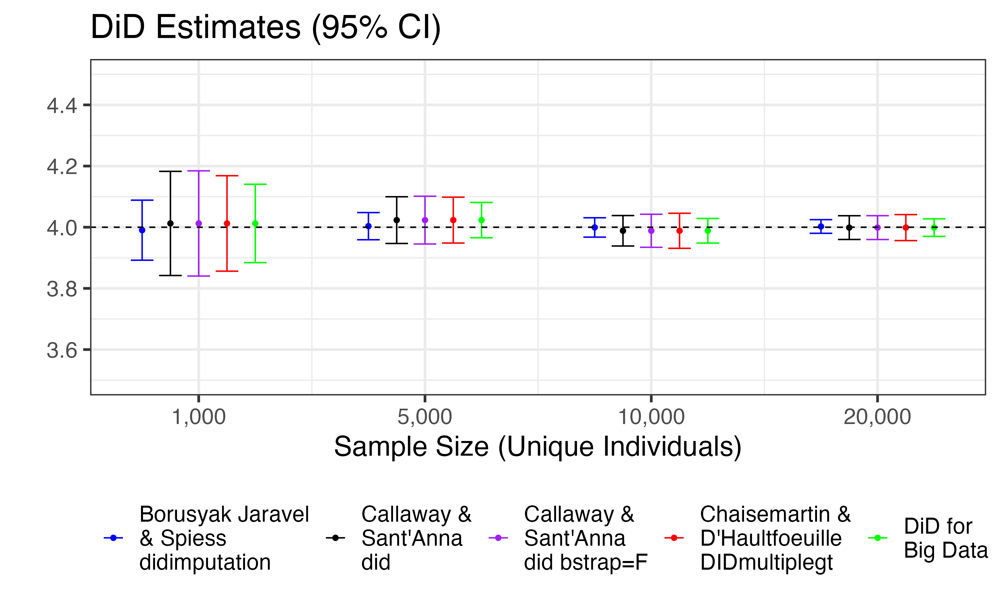
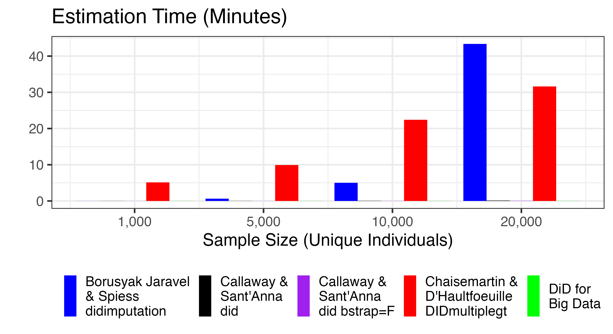
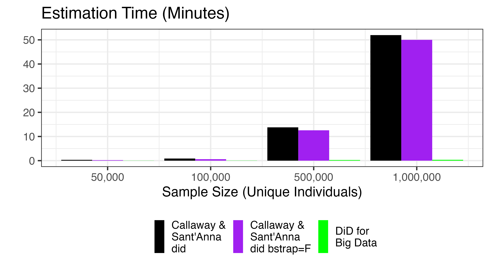
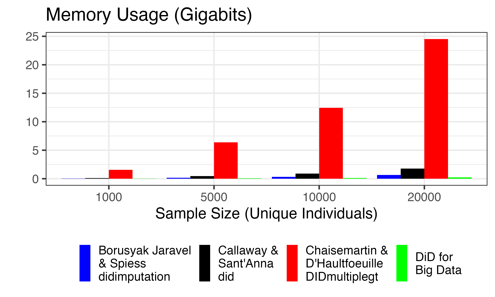
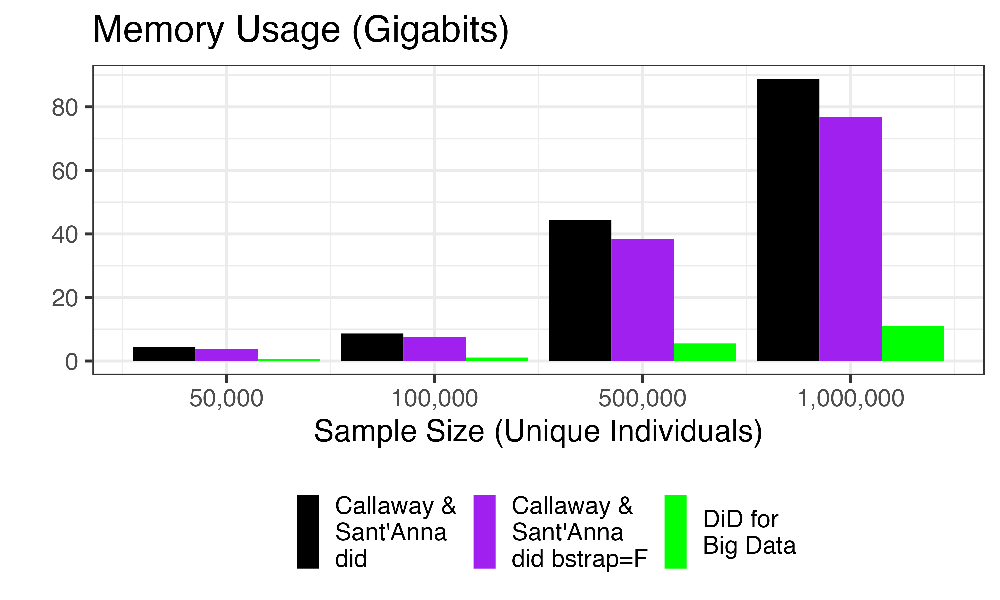

DiD for Big Data in R
================

This R package provides a big-data-friendly and memory-efficient
difference-in-differences (DiD) estimator for staggered (and
non-staggered) treatment contexts. It supports controlling for
time-varying covariates, heteroskedasticity-robust standard errors, and
(single and multi-way) clustered standard errors. The theory behind
`DiDforBigData` is available here as a slide deck:
[slides](vignettes/DiDforBigData_theory.pdf).

# Motivation

#### Background:

DiD has long been implemented using OLS to estimate a two-way
fixed-effects (TWFE) regression in which the coefficient on a
treatment-time interaction term corresponds to the DiD estimate. Over
the past few years, a literature proved that the traditional DiD
estimation strategy is generally biased and inconsistent if treatment
roll-out is staggered over time. Under staggered treatment, TWFE
implicitly uses already-treated units as part of the control group for
newly-treated units, resulting in invalid comparisons.

In response, recent papers have proposed various DiD estimators that are
consistent in the presence of staggered treatment; see [Roth, Sant’Anna,
Bilinksi, and Poe
(2022)](https://jonathandroth.github.io/assets/files/DiD_Review_Paper.pdf)
for a literature review. Despite the wide-spread knowledge that TWFE
estimation of DiD is biased and inconsistent if treatment is staggered,
I have repeatedly seen authors use TWFE at recent (2022) seminars and
conferences. When asked about this, the authors readily acknowledged
that they *should* use estimators that account for staggered treatment,
but their data was too large to perform the estimation using available
software.

#### Big Data Challenge:

To verify that existing packages for staggered DiD could not handle
large samples, I wrote a simple panel data simulator with staggered
treatment roll-out and heterogeneous treatment effects. I simulated it
with different numbers of individuals and applied the available R
packages that implement the methods of:

- [Borusyak, Jaravel, and Spiess
  (2022)](https://www.xavierjaravel.com/_files/ugd/bacd2d_ebf772e1b7ea4a178a060e6ebfcfa056.pdf);
- [Callaway & Sant’Anna
  (2021)](https://psantanna.com/files/Callaway_SantAnna_2020.pdf); and
- [de Chaisemartin & D’Haultfoeuille
  (2020)](https://drive.google.com/file/d/1D93ltJUirR4zIqJZfSTwSLrA-6rSZpTJ/view).

I found that only the Callaway & Sant’Anna (2021) implementation could
successfully estimate DiD with 100,000 unique individuals. While many
DiD applications consider only a small number of unique individuals
(e.g. effects of a state-level policy on state-level aggregate outcomes
would typically have only 50 or so unique units), DiD designs at the
household-level or firm-level using administrative data often involve
millions of unique individuals.

Estimating DiD with large administrative data poses three challenges:

1.  **Speed:** If there are millions of observations, DiD is infeasible
    or extremely slow to estimate with available software. We need
    software that can handle large sample sizes. It needs to avoid slow
    operations such as bootstrapping standard errors or estimating
    fixed-effects.
2.  **Memory:** Administrative data is often stored on crowded servers
    with limited memory available for researchers to use. We need to
    avoid memory-intensive operations (e.g. matrix inversion, data
    stacking).
3.  **Dependencies:** Administrative data is often stored on secure
    servers on which it is impossible to install software that requires
    compilation. We need a package that only depends on
    commonly-available software.

I wrote this package to address all three issues.

# DiD for Big Data

#### Philosophy:

There are 4 guiding principles behind `DiDforBigData`:

1.  **Separability:** The main achievement of this package is to
    leverage the inherent separability of DiD contexts: the DiD estimate
    for one (treatment cohort, event time) pair does not depend on the
    DiD estimate for any other (treatment cohort, event time) pair; see
    the Theory section for details. The full dataset can thus be split
    into many tiny subsets defined by each (treatment cohort, event
    time) pair, with DiD estimated separately on each. Estimating
    1-parameter each on K tiny datasets is much faster than estimating
    K-parameters on one large dataset. Furthermore, each of the small
    problems can be solved simultaneously using parallel processing,
    yielding even greater gains in speed.
2.  **Pre-differencing:** Within each of these tiny datasets, there is
    an observation from the event time of interest as well as an
    observation from the base period. By defintion, only the
    *difference* between the event time and the base period contributes
    to the DiD estimate. Thus, there is no reason to provide the two
    observations (base period and outcome period) separately to the
    regression. Instead, we can take the difference between the two
    observations and provide the difference to the regression, thus
    reducing the sample size in half that is provided to the regression.
3.  **No fixed-effects:** An individual is informative about a DiD
    estimate if and only if that individual is observed for both the
    base period and the outcome period of interest; see the Theory
    section for details. An individual can be informative about some
    (treatment cohort, event time) DiDs while being uninformative about
    others depending on the pattern of missing observations. To remove
    the partially-missing observations, a common solution is to include
    unit fixed-effects, which is extremely computationally intensive.
    Instead, this package focuses on one (treatment cohort, event time)
    tiny dataset, pre-differences within the tiny dataset, and drops
    those units for which the difference is missing. This solves the
    problem of unbalancedness without fixed-effects while maximizing the
    sample size used to estimate each DiD.
4.  **Analytic standard errors:** Heteroskedasticity-robust standard
    errors as well as clustered standard errors are straightforward to
    derive for each of the (treatment cohort, event time) DiD estimates
    using the pre-differenced representation, as well as for averages
    across DiD estimates; see the Theory section for details. This
    avoids bootstrapping, which is extremely computationally intensive.

#### Result:

Using this philosophy, `DiDforBigData` provides a fast and
memory-efficient implementation of DiD in the presence of staggered
treatment:

1.  **Speed:** This package provides estimation and inference for DiD
    with millions of observations and staggered treatment in less than 1
    minute. Breaking the large problem into a series of small problems,
    none of which includes fixed-effects, makes the estimation orders of
    magnitude faster (see demonstration below).
2.  **Memory:** This package avoids memory-intensive activities like
    matrix-inversion, fixed-effect estimation, data-stacking, and
    bootstrapping. As a result, it uses much less memory than other
    available software (see demonstration below).
3.  **Dependencies:** This package has only *two* dependencies,
    `data.table` for big data management and `sandwich` for robust
    standard error estimation, which are already installed with most R
    distributions. This package will also use `fixest` to speed up the
    estimation if `fixest` is installed on your system, and estimation
    can be run in parallel if the `parallel` package is available, but
    these are optional.

# Demonstration

This section will compare the following implementations of DiD
estimators for staggered treatment contexts:

1.  The implementation of the Borusyak, Jaravel, and Spiess (2022)
    approach in R package `didimputation`;
2.  The implementation of the Callaway & Sant’Anna (2021) approach in R
    package `did`;
3.  The implementation of the de Chaisemartin & D’Haultfoeuille (2020)
    approach in R package `DIDmultiplegt` using 40 bootstrap draws for
    standard errors (`brep=40`); and,
4.  My R package `DiDforBigData`.

Regarding Callaway & Sant’Anna (2021), there are many options available
in this package, so I compare three: the default (doubly-robust); the
estimation method `est_method = "reg"` (not shown below since it gives
nearly identical results as the default); and the case in which standard
errors are computed analytically rather than by bootstrap (`bstrap=F`).

Below, I draw the simulated data 3 times per sample size, and apply each
estimator. Results are presented for the median across those 3 draws.
Sample Size refers to the number of unique individuals. Since there are
10 simulated years of data, and the sample is balanced across years, the
number of observations is 10 times the number of unique individuals.

A caveat: in the following simulations, I consider contexts in which all
of the usual assumptions are satisfied. Under these assumptions, all of
the estimators considered are consistent. However, in empirical contexts
in which these assumptions do not hold, only some of the estimators may
be valid. For example, only the approach of de Chaisemartin &
D’Haultfoeuille (2020) can allow for treatments that switch off and on
repeatedly for the same individual.

#### Estimates

I verify that all of the estimators provide similar point estimates and
standard errors. Here, I show the point estimates and 95% confidence
intervals (using +/- 1.96\*SE) for the DiD estimate at event time +1
(averaging across cohorts). The true ATT is 4 at event time +1. I also
verify that two-way fixed-effects OLS estimation would find an effect of
about 5.5 at event time +1 when the sample is large.

A caveat: The Callaway and Sant’Anna (2021) estimators provide standard
errors that correspond to *multiple-hypothesis testing* and will thus
tend to be wider. My package provides the usual single-hypothesis
testing, consistent with the standard errors usually reported on
regression coefficients.

#### Speed test

**Small Samples:** Here is the run-time required to complete the DiD
estimation using each package:

We see that, with 20,000 unique individuals, the implementations of the
Borusyak, Jaravel, and Spiess (2022) and de Chaisemartin &
D’Haultfoeuille (2020) approaches have become very slow. I could not get
either approach to run successfully with 100,000 unique individuals, as
they both crash R.

**Large samples:** Given the above results, we cannot rely on the
implementations of the Borusyak, Jaravel, and Spiess (2022) and de
Chaisemartin & D’Haultfoeuille (2020) approaches if there are 100,000 or
more individuals. We now compare the implementation of the Callaway &
Sant’Anna (2021) approach to `DiDforBigData` when the sample size is
large.

Even with 1 million unique individuals (and 10 million observations), it
is difficult to see `DiDforBigData` in the plot, as estimation requires
about half of a minute, versus nearly 1 hour for the implementation of
the Callaway & Sant’Anna (2021) approach. Thus, `DiDforBigData` is
roughly *two orders of magnitude* faster than the Callaway & Sant’Anna
(2021) approach when working with a sample of one million individuals.

#### Memory test

**Small Samples:** Here is the memory used to complete the DiD
estimation by each package:

We see that the implementation of the de Chaisemartin & D’Haultfoeuille
(2020) method uses much more memory than the other approaches. The other
approaches all use relatively little memory at these sample sizes.

**Large Samples:**

When considering large samples, we see that `DiDforBigData` uses less
than half of the memory used by the Callaway & Sant’Anna (2021)
approach.
