```{r, include = FALSE}
knitr::opts_chunk$set(
  collapse = TRUE,
  comment = "#>"
)
```


The slides are available in pdf form here: [slides](DiDforBigData_theory.pdf). For convenience, they are converted to PNG images here:

 

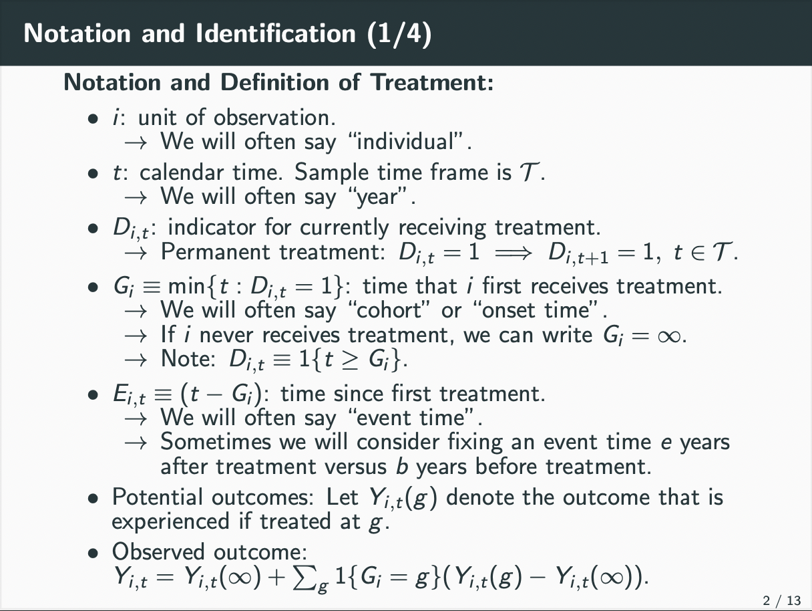 


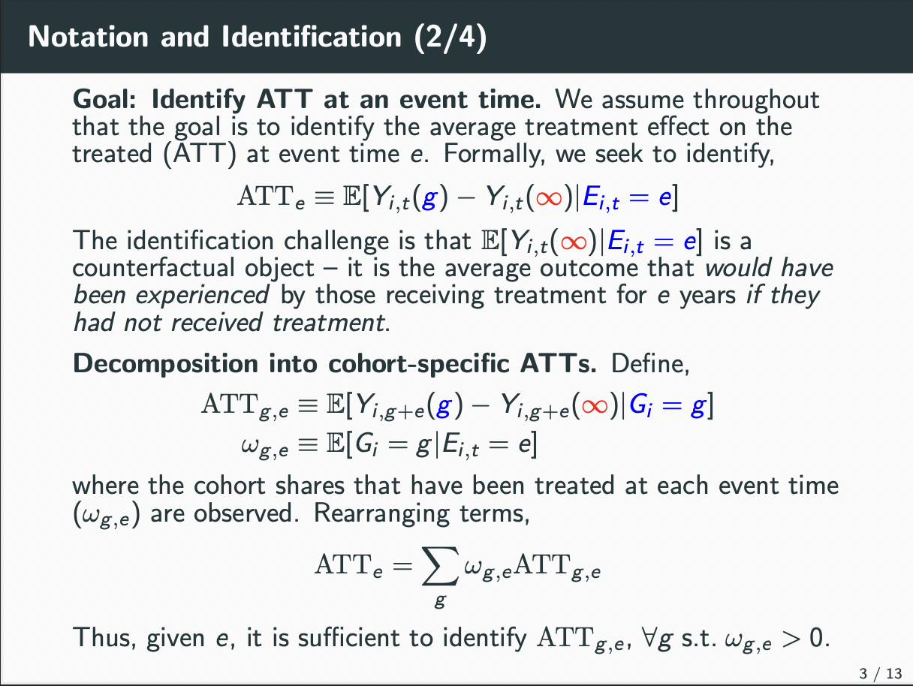 


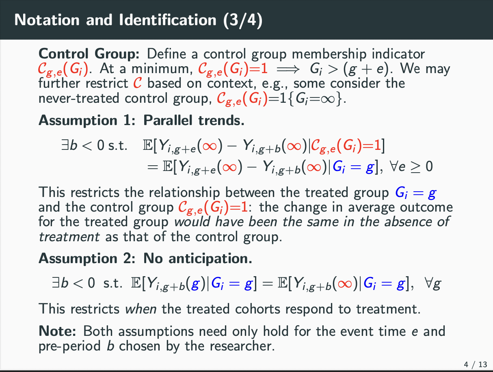 


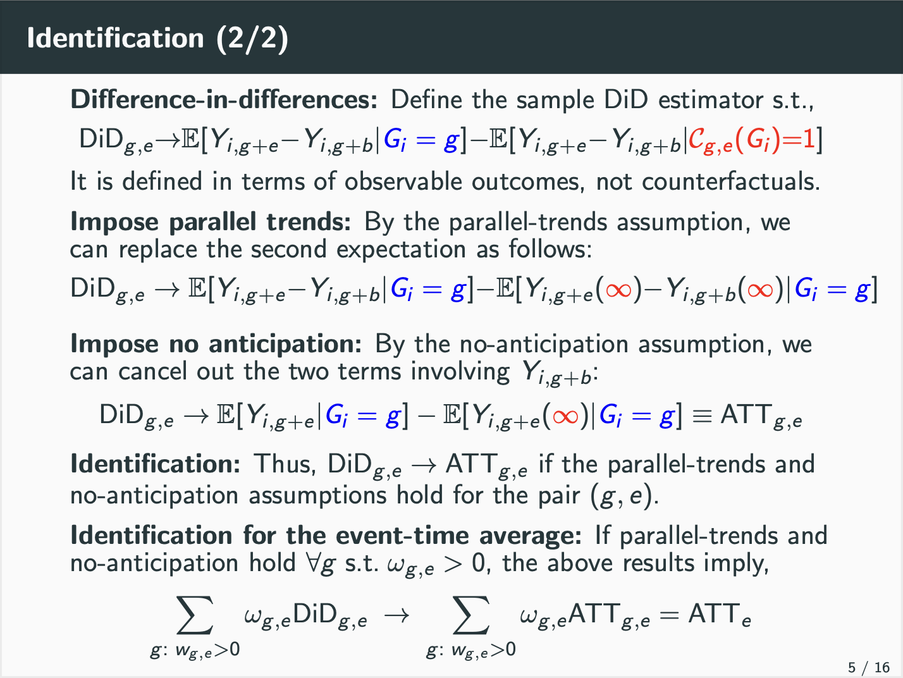 


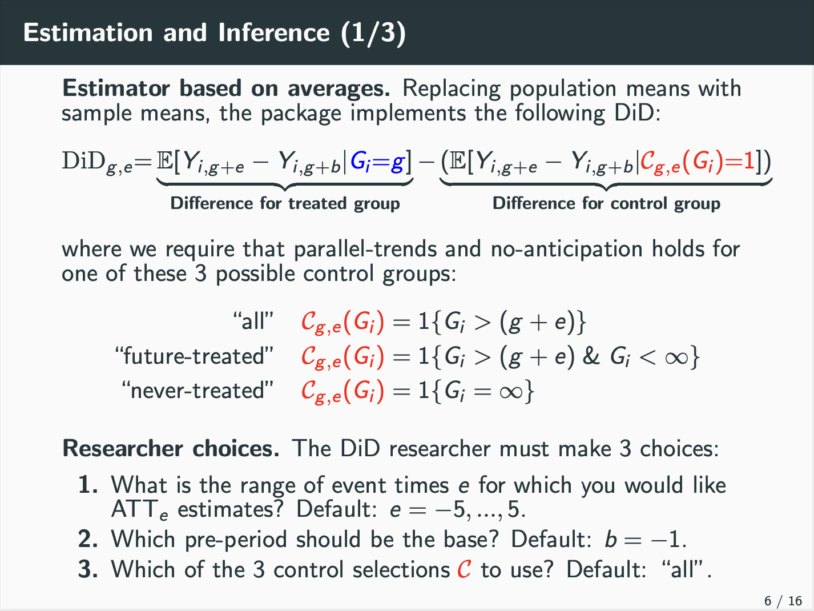 


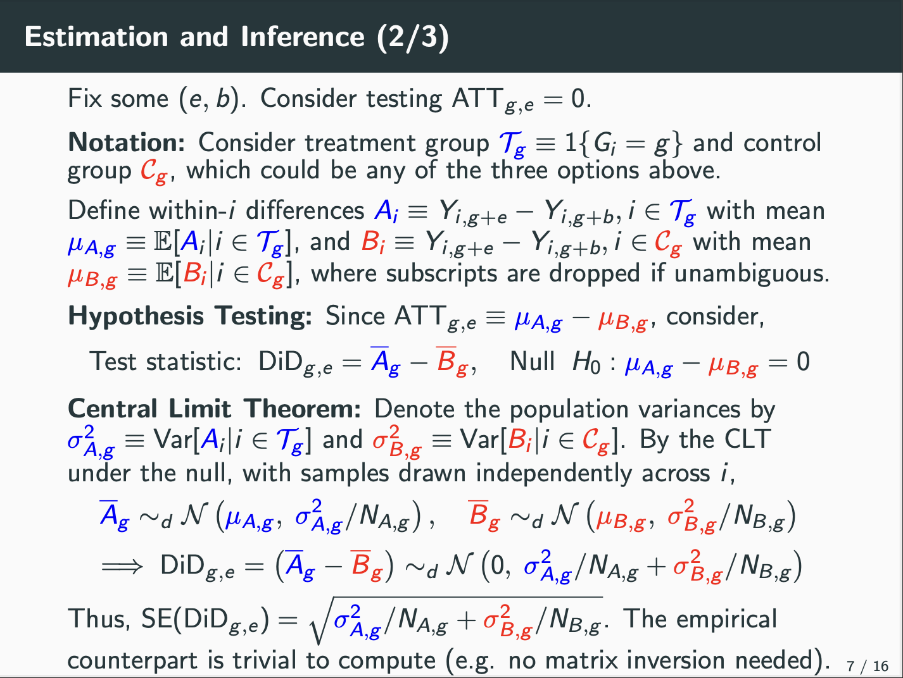 


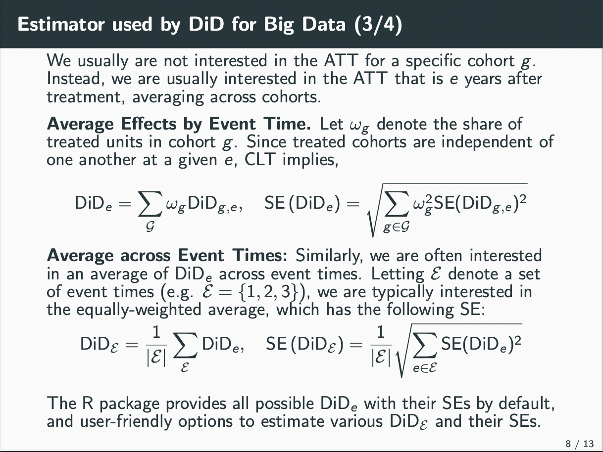 


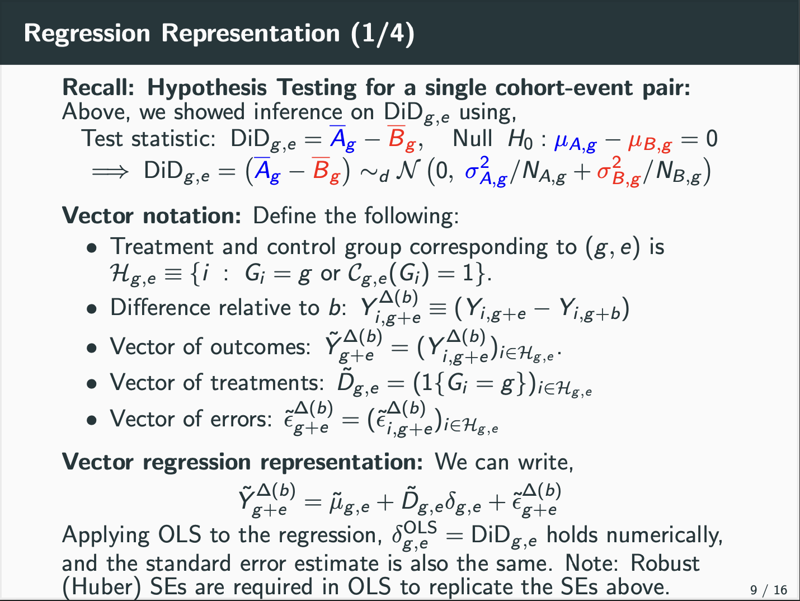 

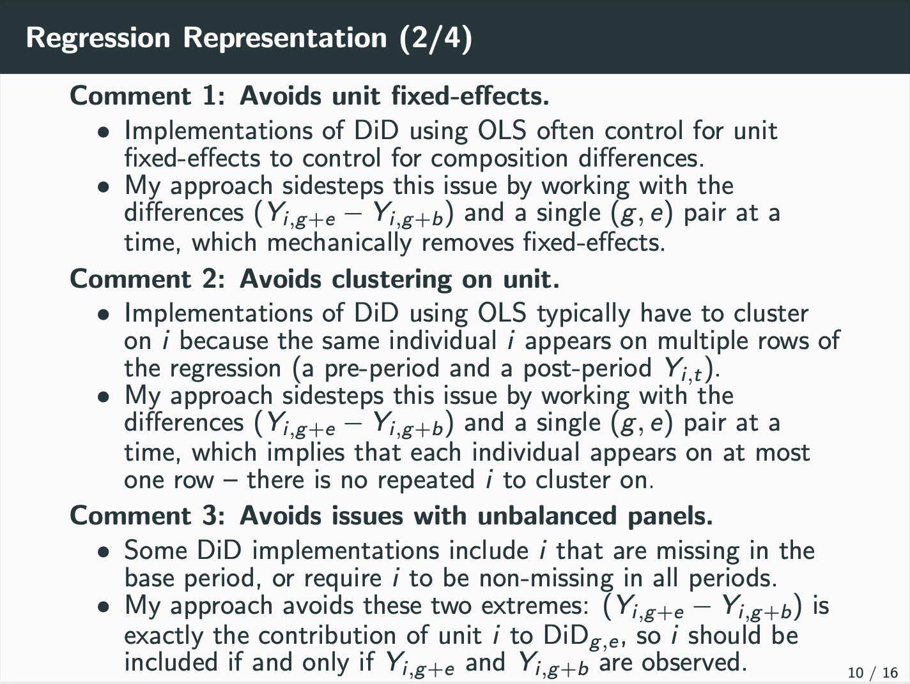 

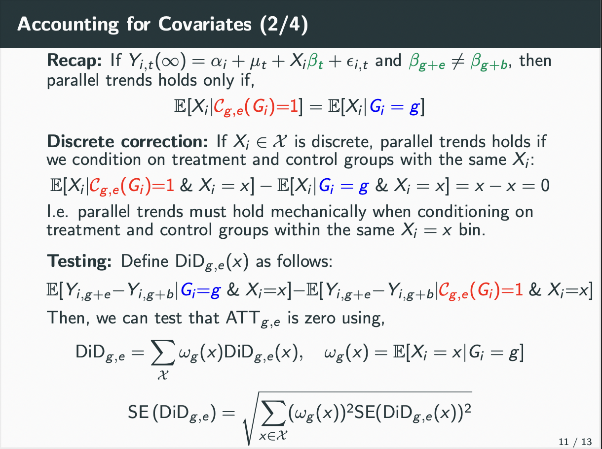 

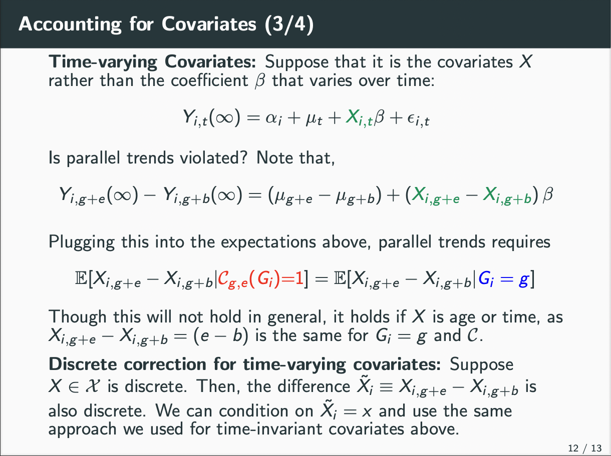 

 

